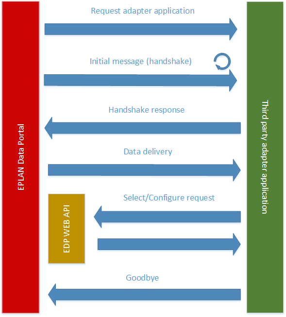

EPLAN Data Portal Adapters Documentation
===

 A simple way to configure or select desired parts into users' baskets.
 
 Quick Start
 ---
 In order to run project you need to install dependencies via:
 ```
 npm install
 ```
 after that you can simply run it by:
 ```
 npm run start
 ```
 
 Selector
 ---
 Third party application (website) allowing to select already existing parts in Data Portal database (without any customization).

 [Video](resources/selector.mp4) that shows usage of selector.

 Configurator
 ---
 Third party application (website) that may customize parts to have properties not existing in Data Portal database.

 [Video](resources/configurator.mp4) that shows usage of configurator.

Under the hood
---
 The way this process works is described on the image below.
 Data Portal utilises [MessageEvents](https://developer.mozilla.org/en-US/docs/Web/API/MessageEvent)
 delivered through [postMessage](https://developer.mozilla.org/en-US/docs/Web/API/Window/postMessage) calls to transfer data between third party side and the portal itself.

 

Details
---
 Once adapter is opened (either selector or configurator through  icon in Data Portal),
  given adapter handler is loaded by it's url. To make sure the adapter is loaded, following initial message is being sent in intervals untill the adapter responds with the same:
 ```json
 {
   "type": "status",
   "body": "init"
 }
 ```

 When initial message is received, finally, data shall be received by the adapter:
  * for selector:
     ```json
     {
       "type": "data",
       "body": {
           "type": "selectorrequest",
           "token": "",
           "language": "",
           "eplan_version": "",
           "follow_up_url": "",
           "filters": {
               "target_market": "",
               "eplan_catalog_selection": {
                   "id": null,
                   "name": ""
               }
           }
       }
     }
     ```
  * for configurator:
     ```json
     {
       "type": "data",
       "body": {
           "type": "configuratorrequest",
           "token": "",
           "language": "",
           "eplan_version": "",
           "follow_up_url": "",
           "root_part_number": "",
           "order_number": "",
           "type_number": "",
           "filters": {
               "target_market": "",
               "eplan_catalog_selection": {
                   "id": null,
                   "name": ""
               }
           }
       }
     }
     ```

| Field | Description |
| ----- | ----------- |
| type | Type of adapter that's been selected |
| token | Adapter's token, valid for next 3 hours or untill the process is successful |
| language | User's selected language |
| eplan_version | User's EPLAN version |
| follow_up_url | EPLAN Data Portal url |
| root_part_number | (configurator only) Selected part's part number |
| order_number | (configurator only) Selected part's order number |
| type_number | (configurator only) Selected part's type number |
| filters | Object with users filters (context) in time of adapter initialization |
| target_marget | User's target market |
| eplan_catalog_selection | User's EPLAN catalog state in time of adapter initialization with it's representing id and name |
| custom_data | Data provided by manufacturer in part's free property 74 |

Once configuration process is complete on the third party site, final API request may be sent accoding to the
[EPLAN WEB API Online documentation](http://eplandata.de/portal/api/doc/).
When the process is complete, final message shall be sent to the client to finalize the process and redirect user to
the next page:
```json
{
  "type": "status",
  "body": "done"
}
```
